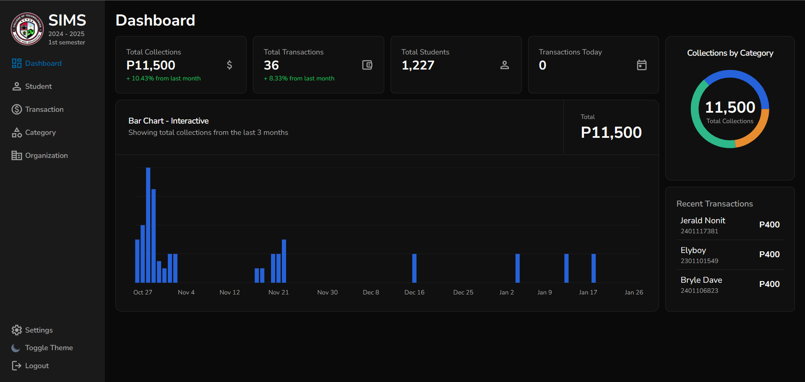
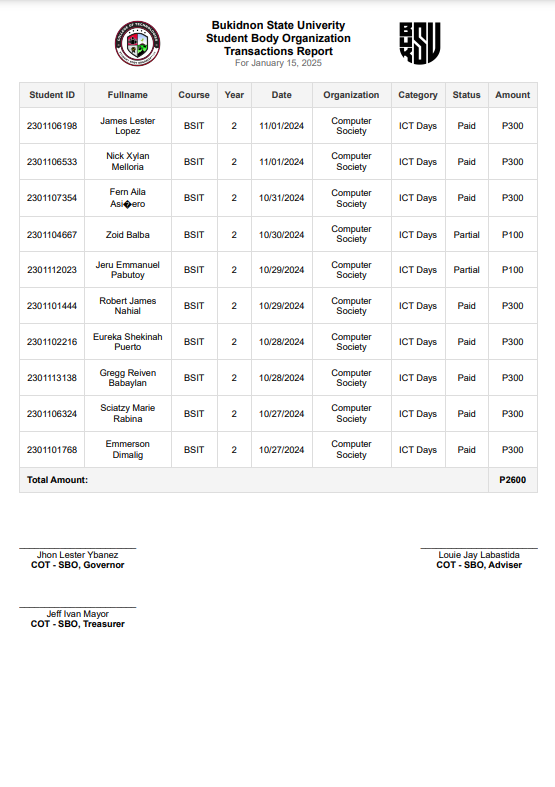

# SBO - Student Information Management System

A simple and intuitive web application designed to help you easily track student collections for specific events. Built with a modern tech stack for a seamless and responsive user experience, this app ensures efficient tracking and management.

## Status

🚧 **Under Development**: This application is currently a work in progress, and new features and improvements are being actively added. Some features may be incomplete or subject to change.

## Screenshots

### Dashboard

### Students Page

### Transactions Page

### Add Transaction

### Financial Report Sample

## Features

- **Student Management**: Easily add, edit, and remove students from the system.
- **Event & Category Creation**: Create custom events or categories for which students will be making payments.
- **Transaction Management**: Track, update, and manage all student transactions efficiently.
- **Organization Management**: Manage what organization facilitates certain events & categories.
- **Dynamic Database**: Dynamically change which database to fetch data from based on user settings, which allows a more modular way storing information.
- **Authentication & Authorization**: Secure login and user management to ensure only authorized users can access or modify data.
- **Transaction PDF Report**: Download a PDF of transactions report
- **Import Students**: Import a list of students via CSV file

## Getting Started

### With Docker

1. Create a `.env` file and fill it up with the given sample env

2. In your terminal, cd into the same directory as docker-compose.yml

3. Enter `docker-compose up --build` and wait for it to finish building the app

4. Once finished, you should be able to access the app at http://localhost:5173

### Without Docker

1. Create a `.env` file and fill it up with the given sample env

2. Open two terminal, each terminal cd into server directory and the other one for client directory

3. In each terminal, enter `npm install` to install the dependencies

4. In each terminal, enter `npm run dev` to run both the server and the client

5. Once finished, you should be able to access the app at http://localhost:5173

6. If the server complains about some mongo error, its probably because your local mongo server is not running. Make sure to install it or run it if its already installed by running `mongod` in your terminal

Running the app on production will be posted soon

## Technologies Used

### Frontend

- **TypeScript**
- **React**
- **Tailwind CSS**
- **Vite**
- **Shadcn**

### Backend

- **TypeScript**
- **Express**
- **Node.js**
- **MongoDB**
- **Mongoose**
- **Cloudinary**

## Libraries Used

### Frontend

- **[react-hook-form](https://www.npmjs.com/package/react-hook-form):** Simplifies form state management and validation.
- **[react-router-dom](https://reactrouter.com/en/main):** Routing for React applications.
- **[zod](https://zod.dev/):** Schema validation for forms.
- **[react-query](https://www.npmjs.com/package/react-query):** Data fetching and caching.
- **[axios](https://axios-http.com/docs/intro):** Promise-based HTTP client.
- **[date-fns](https://date-fns.org/docs/Getting-Started):** JavaScript date utility library.
- **[zustand](https://zustand.docs.pmnd.rs/getting-started/introduction):** React state management library
- **[lodash](https://lodash.com):** A modern JavaScript utility library
- **[zustand](https://zustand-demo.pmnd.rs/):** A small, fast and scalable bearbones state-management solution.

### Backend

- **[bcryptjs](https://www.npmjs.com/package/bcryptjs):** Password hashing and salting.
- **[jsonwebtoken](https://www.npmjs.com/package/jsonwebtoken):** JSON Web Token implementation.
- **[dotenv](https://www.npmjs.com/package/dotenv):** Environment variable management.
- **[express-validator](https://www.npmjs.com/package/express-validator):** User input validation middleware.
- **[cloudinary](https://cloudinary.com/):** Image upload and storage.
- **[multer](https://www.npmjs.com/package/multer):** File upload middleware for Node.js.
- **[express-async-handler](https://www.npmjs.com/package/express-async-handler):** Asynchronous error handling middleware.
- **[cors](https://www.npmjs.com/package/cors):** Middleware for enabling CORS.
- **[date-fns](https://date-fns.org/docs/Getting-Started):** JavaScript date utility library.
- **[csv-parser](https://www.npmjs.com/package/csv-parser):** CSV parsing utility tool.
- **[puppeteer](https://pptr.dev/):** For generating PDF file for transactions report
